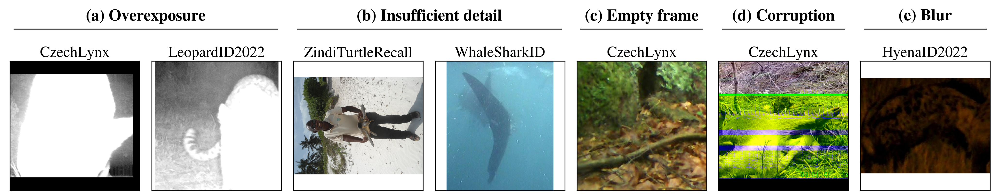

# Datasets and protocols

Eight open wildlife re-identification datasets. Six come from WildlifeReID-10k with
its official splits; CzechLynx uses its time-closed split; SalamanderID2025 (AnimalCLEF
2025) uses a split defined for this work because its query labels are not public.

The **database** split forms the retrieval gallery and is the only data used for
fine-tuning. **Query** images are evaluated against it and never seen in training.
Images are noisy and are not filtered.

## Statistics

| Dataset | Source | DB images | Q images | DB IDs | Q IDs | Med. | Max | Top 10 % | Single |
|---|---|---:|---:|---:|---:|---:|---:|---:|---:|
| Nyala | WildlifeReID-10k (NyalaData) | 1,514 | 428 | 237 | 236 | 5 | 25 | 30 % | 24 % |
| Hyena | WildlifeReID-10k (HyenaID2022) | 2,499 | 630 | 256 | 256 | 6 | 72 | 35 % | 2 % |
| Leopard | WildlifeReID-10k (LeopardID2022) | 5,373 | 1,433 | 430 | 380 | 3 | 329 | 70 % | 31 % |
| Sea star | WildlifeReID-10k (SeaStarReID2023) | 1,759 | 428 | 95 | 95 | 14 | 30 | 15 % | 0 % |
| Whale shark | WildlifeReID-10k (WhaleSharkID) | 6,108 | 1,585 | 543 | 512 | 6 | 123 | 42 % | 14 % |
| Turtle | WildlifeReID-10k (ZindiTurtleRecall) | 9,721 | 3,082 | 2,265 | 2,251 | 2 | 92 | 39 % | 3 % |
| Salamander | SalamanderID2025 | 1,138 | 246 | 584 | 221 | 1 | 11 | 31 % | 64 % |
| CzechLynx | CzechLynx, time-closed split | 27,836 | 11,924 | 319 | 319 | 26 | 2,465 | 61 % | 0 % |

*Med.* and *Max* are the median and maximum number of database images per individual.
*Top 10 %* is the share of all database images held by the 10 % most photographed
individuals. *Single* is the share of individuals with one image.

!!! note
    Statistics follow the manuscript's dataset table; the page's copy is checked against
    the paper source by the repository's test suite.

## Salamander split

For each individual photographed on at least two capture dates, all images of its
latest date are queries and the remaining images form the database. Backgrounds were
removed with text-prompted SAM 3 (prompt "Salamander", all detected instances merged
because an occluding finger can split one animal into several instances).

## Candidate budget

The default candidate budget is \(k = 250\); results are swept over
\(k \in \{10, 50, 100, 250, 500, 1000\}\). Increasing \(k\) raises the chance that the
correct individual is in the candidate list but costs proportionally more matching
time.

## Unseen-identity protocol (CzechLynx)

The matcher is trained on the training part of the CzechLynx time-open split (275
individuals). Evaluation uses the 44 individuals that appear in the test part of that
split but not in its training part. For each of them, the earliest encounter forms the
gallery (160 images) and later encounters the queries (2,081 images), which rules out
encounter-level leakage. Budgets are
\(k \in \{10, 50, 100, 160\}\), where 160 scores the whole gallery.

The protocol is generated by `scripts/build_unseen_eval_metadata.py`, which groups
images by encounter and assigns the earliest group to the gallery. It is never a random
image-level split.

## Known data problems

<figure class="wm-figure" markdown>

<figcaption>Examples of challenging images in the benchmark datasets. Raw frames that are overexposed (a), show too little of the animal to see its markings (b), contain no visible animal (c), are corrupted (d), or are blurred (e). Such images remain in the database and query sets of all methods.</figcaption>
</figure>

The [Data challenges](challenges.md) page shows many more confirmed examples per problem,
separates dataset noise from inherent difficulties such as night frames and occlusion, and
reports how many images each audit flag caught and whether flagged queries are less
accurate. Problems visible only in the masks, not in the raw photos, are described there in
text.

## Licensing

| Dataset | License as far as recorded |
|---|---|
| Hyena, Leopard (LILA BC) | CDLA-Permissive |
| CzechLynx synthetic renders (teaser only) | CC BY 4.0, Zenodo record 17592004 |
| Nyala, Sea star, Whale shark, Turtle | See the WildlifeReID-10k distribution |
| Salamander (AnimalCLEF 2025, Kaggle) | Open item |
| CzechLynx photographs | Open item |

!!! warning "Open item"
    Image licenses must allow redistribution before any photograph on this page is
    published.
