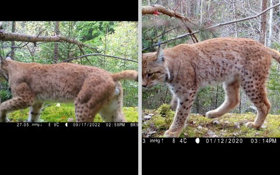
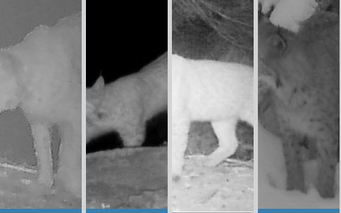
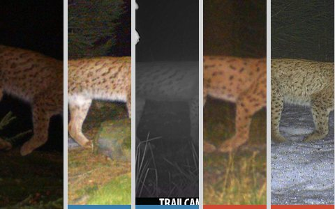
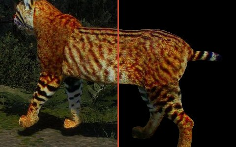
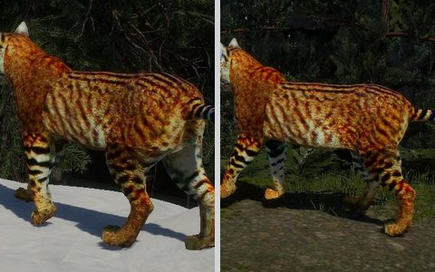

# Demo

Five interactive views of what WildMatch does, each on its own page. They follow the
paper's argument: first the direct before/after comparison, then an honest look at where
fine-tuning helps and where it does not, then the weak supervision the method learns
from, the background-masking step every image passes through, and finally a playground
on synthetic renders. Use the arrows at the bottom of each page to walk through them in
order.

!!! tip "Try it on your own photos"
    The [WildMatch Space on Hugging Face](https://huggingface.co/spaces/turhancan97/wildmatch) matches two photos of your choice with the
    default or the fine-tuned matcher, and finds a lynx in the gallery of 44 individuals the matcher never saw.

<a class="wm-hub-card" href="before-after/">

<h3>Before and after fine-tuning</h3>

One photo pair per dataset, matched by the default matcher and by WildMatch. Switch between them and watch the correspondences and the score change.

Open the demo
</a>

<a class="wm-hub-card" href="rank-changes/">

<h3>Rank changes</h3>

Whole-split counts of rescued, regressed and still-wrong queries on CzechLynx, with random examples under cosine retrieval, default LoMa and WildMatch.

Open the demo
</a>

<a class="wm-hub-card" href="mined-pairs/">

<h3>Mined pairs</h3>

The training signal: for each anchor, the positives and hard negatives the pretrained matcher mined, with their scores and correspondences.

Open the demo
</a>

<a class="wm-hub-card" href="masking/">

<h3>Background masking with SAM 3</h3>

Drag a divider between the raw image and the masked model input, compare SAM 3 with the masks a dataset ships, and read the detection confidence.

Open the demo
</a>

<a class="wm-hub-card" href="synthetic/">

<h3>Synthetic keypoint matching</h3>

Ten synthetic lynxes, two renders each. Pick a query, let the fine-tuned matcher rank the gallery and inspect every correspondence.

Open the demo
</a>

## How to read the demos

- **Score** is the matcher's image score: the summed confidence of the mutual-nearest
  matches above the threshold, divided by the smaller keypoint count, as in the paper.
- **Lines** are correspondences between the two photos. Their weight follows confidence,
  hovering one shows its exact value, and a slider sets how many of the strongest are
  drawn.
- **Masks**: matches are computed on background-removed inputs, the inputs the paper
  uses, and drawn on the original photos.
- **Frames**: blue marks the true individual, red marks a hard negative or a SAM 3 mask
  outline; each page explains its own colours.

<small>Photographs from CzechLynx (Picek et al.), WildlifeReID-10k and SalamanderID2025
(AnimalCLEF 2025), the latter shown with the dataset team's permission. Synthetic lynx
renders from the CzechLynx synthetic subset, Zenodo record 17592004, CC BY 4.0.</small>
