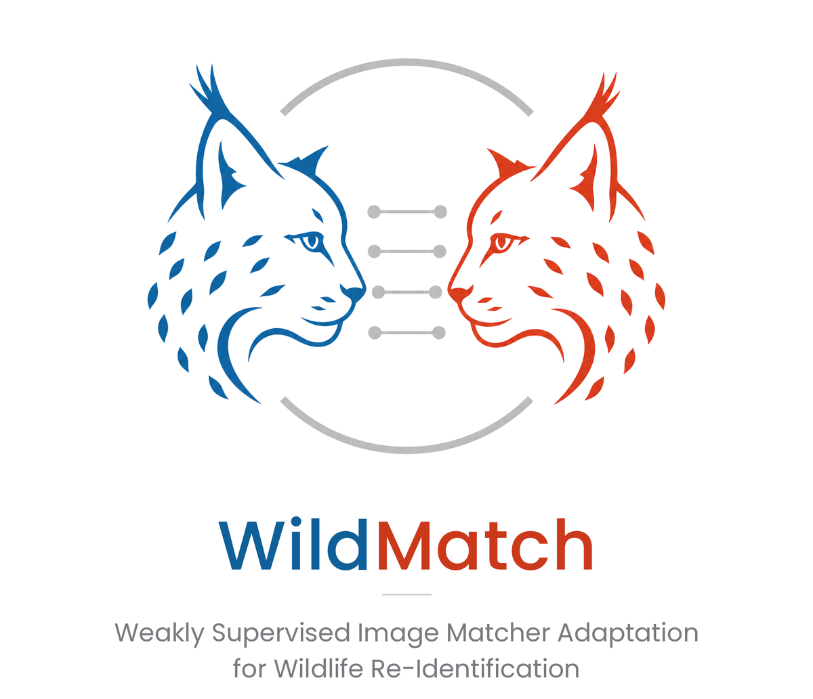
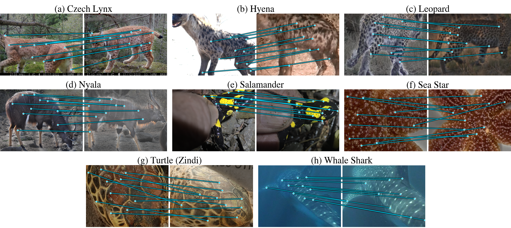

{ .wm-logo }

Manuscript · preprint to follow

# WildMatch: Weakly Supervised Image Matcher Adaptation for Wildlife Re-Identification

Adapting a pretrained keypoint matcher to a wildlife domain with identity labels only, without keypoint or correspondence annotation.

Turhan Can Kargin*1,2 ·
Piotr Kubaty*1,2 ·
Ekaterina Rostovskaya5,2 ·
Izabela Wierzbowska5 ·
Bartosz Zieliński1,3 ·
Marcin Przewięźlikowski1,4

* Equal contribution ·
1 Faculty of Mathematics and Computer Science, Jagiellonian University, Kraków ·
2 Doctoral School of Exact and Natural Sciences, Jagiellonian University, Kraków ·
3 Jagiellonian Center for Artificial Intelligence, Kraków ·
4 NASK National Research Institute, Warsaw ·
5 Institute of Environmental Sciences, Faculty of Biology, Jagiellonian University, Kraków

[Paper](paper.md){ .md-button .md-button--primary }
[Results](results.md){ .md-button }
[Code](code.md){ .md-button }
[Reproduce](reproduce/index.md){ .md-button }

!!! warning "Draft page"
    This page is a private draft that mirrors the manuscript as of 2026-10-02. Sections
    marked *draft* follow text that the authors are still revising.

## Abstract

Individual animal re-identification from camera-trap imagery is an instance retrieval problem central to non-invasive wildlife monitoring: a query image must retrieve the correct individual from a reference set of known animals. This requires computer vision models to recognize distinctive local patterns in fur, skin, or other visual markings. Current approaches either learn global embeddings as a classification problem, requiring many labeled images per individual while largely ignoring local evidence, or apply off-the-shelf, domain-agnostic image matchers. Although such matchers are pretrained on large and diverse image collections, adapting them to wildlife imagery is challenging because available datasets are small and lack correspondence-level annotations. We study weakly supervised adaptation of a pretrained keypoint matcher using only identity labels, without keypoint-level or geometric correspondence ground truth. We mine informative image pairs with the pretrained matcher, derive weak positive and negative supervision from identity agreement, and contrastively fine-tune the matching network to strengthen correspondences for same-identity pairs and suppress them for different identities. Across open-source wildlife re-identification datasets, our approach improves accuracy over off-the-shelf matchers and a state-of-the-art local--global fusion method. Under an open-world protocol with held-out individuals, it learns a transferable correspondence prior rather than memorizing training identities. To our knowledge, this is the first study of matcher-level, identity-supervised adaptation for animal re-identification. Our method enables data-efficient specialization of image matching models to wildlife domains using identity annotations already available in typical monitoring datasets.

## Contributions

1. **WildMatch**, a weakly supervised procedure that adapts a pretrained image matcher
   to a wildlife domain using only the identity labels of the reference database.
2. **Consistent gains** over off-the-shelf matchers and a local-global fusion baseline
   on eight wildlife re-identification datasets, across candidate budgets.
3. **Transfer to unseen individuals**, and an analysis of where in the matching
   pipeline identity supervision should be applied.

## Try it on synthetic renders

One synthetic query render of a lynx is matched against six synthetic gallery renders by
LoMa + WildMatch, the matcher fine-tuned on CzechLynx. Pick a candidate to see its
correspondences, drag the slider to show more of them, and hover a match to read its
confidence. The matches and scores are real matcher output; the images are synthetic
renders, not the paper's test data, and the scores are not a benchmark result.

Loading the synthetic match demo…

<small>Synthetic lynx renders from the CzechLynx synthetic subset (Picek et al.), Zenodo record 17592004, CC BY 4.0.</small>

## How it works

### Identity labels only
The reference database already names each individual. WildMatch uses nothing else: no keypoint or correspondence annotation.

### Mined pairs
The pretrained matcher scores training pairs once. High-scoring same-identity pairs become positives, high-scoring other-identity pairs hard negatives.

### Adapted matcher
A triplet margin loss on a relaxed matching score updates only the matching module, in about five GPU-hours on CzechLynx.

### Ranked candidates
At test time the adapted matcher scores the candidates of a query and returns a ranked short list for the expert.

## At a glance

<figure class="wm-figure" markdown>

<figcaption>Default (hollow) to fine-tuned (filled) matcher at the default budget k = 250, on the eight datasets of the paper. Numbers are percentage-point gains.</figcaption>
</figure>

<figure class="wm-figure" markdown>

<figcaption>LoMa + WildMatch matches on correct top-1 retrievals (k = 50). For each dataset, a query (left) and its top-1 gallery image (right) of the same individual. Of the 350 to 420 matches found for each pair, lines show the 10 most confident. Matching uses background-removed inputs; the matches are drawn on the original photos.</figcaption>
</figure>

## Limitations and outlook

- **One checkpoint per dataset.** A checkpoint is adapted to one dataset and specialises
  to its species. Training a single matcher on many species at once is a natural next step.
- **Bounded by the shortlist.** The matcher ranks only the candidates retrieved by the
  global encoder, so its accuracy is bounded by that shortlist. Adapting the encoder and the
  matcher jointly could lift it.
- **Dependence on masks.** Results depend on background masks: segmentation errors can
  remove markings or leave background keypoints.
- **Expert evaluation.** An evaluation with domain experts could test whether the adapted
  correspondences follow the markings that experts rely on.

Because it needs only the labels that monitoring projects already keep, requires no
retraining when a new individual is added, and exposes the correspondences behind every
match for inspection, WildMatch offers a practical way to bring adapted image matching
into wildlife monitoring.

Keywords: animal re-identification, instance retrieval, local feature matching, weak
supervision, camera traps.
