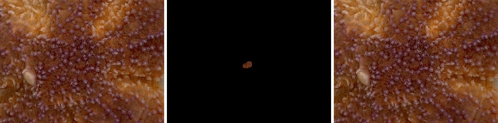
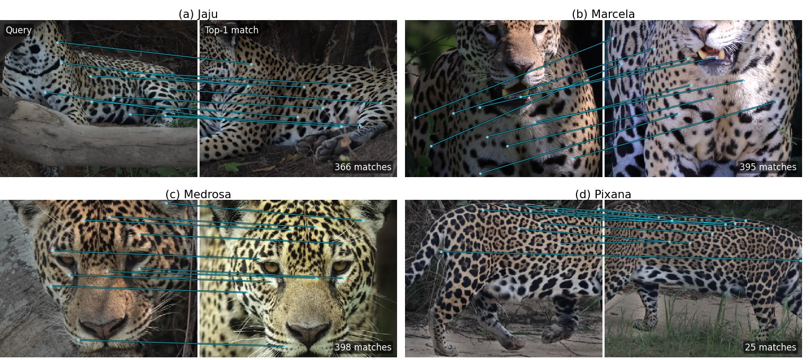

# Beyond the paper

!!! note "Results after the paper"
    Everything on this page was produced after the paper and is not part of it: RDD-LightGlue
    retrained with the paper's LoMa recipe, the paper's methods rerun on new SAM 3 masks, and a
    dataset outside the paper, JaguarReID. The paper's own numbers are on the other result pages.

## RDD-LightGlue with the shared recipe

The paper fine-tunes LoMa with one recipe: the relaxed pair score, a triplet margin objective,
AdamW and pairs mined with LoMa. Most of the paper's RDD-LightGlue checkpoints were trained with an
earlier recipe. We retrained RDD-LightGlue with the LoMa recipe on the seven datasets where it
differed (Hyena, Leopard, Sea star, Whale shark, Turtle, Salamander and CzechLynx open, which serves
the unseen-individual protocol). These retrained checkpoints are now the `wildmatch` defaults and are
on the Hugging Face Hub; the paper's checkpoints stay available
(`wildmatch weights download --set paper`).

<div id="wm-beyond-rdd" class="wm-widget">Loading the RDD-LightGlue comparison…</div>

Top-1 / balanced top-1 in % at \(k = 250\); the last column is the change in top-1 against the
paper's fine-tuned checkpoint (retrained minus paper).

<div class="wm-numeric" markdown>

| Dataset | Default | Paper fine-tuned | Retrained | Change |
|---|---:|---:|---:|---:|
| Hyena | 90.8 / 85.7 | 88.4 / 82.4 | 87.6 / 82.4 | -0.8 |
| Leopard | 82.3 / 55.0 | 80.3 / 52.1 | 77.3 / 49.3 | -3.0 |
| Sea star | 93.7 / 94.5 | 94.2 / 95.1 | 93.7 / 94.8 | -0.5 |
| Whale shark | 63.6 / 52.0 | 63.0 / 53.1 | 66.4 / 55.8 | +3.3 |
| Turtle | 50.5 / 38.7 | 32.8 / 31.8 | 47.1 / 47.4 | +14.4 |
| Salamander | 42.3 / 43.7 | 41.9 / 43.3 | 43.9 / 45.6 | +2.0 |
| CzechLynx unseen (k = 160) | 25.9 / 26.7 | 30.2 / 29.7 | 31.5 / 29.1 | +1.3 |

</div>

- **Where the shared recipe helps:** Turtle gains 14.4 points of top-1 and Whale shark 3.3, with the
  gain growing with \(k\); Salamander and the unseen CzechLynx individuals gain 1 to 2 points.
- **Where it does not:** Leopard loses 3.0 points at \(k = 250\) (up to 6 at \(k = 1000\)); Hyena
  and Sea star change by less than one point.
- **Why:** both checkpoints score exactly the same candidate list, so the difference lies in how
  each scores candidates far down MegaDescriptor-L's ranking, which only enter at larger \(k\).
  On Leopard the retrained checkpoint lets more of these far candidates outscore the right
  individual; on Turtle it lets fewer.
- On Hyena, Leopard and Turtle the default RDD-LightGlue has a higher top-1 than both fine-tuned
  versions at \(k = 250\), so fine-tuning RDD-LightGlue does not raise top-1 on every dataset.

## SAM 3 masks

The paper's WildlifeReID-10k inputs are background-removed photos made earlier in the project,
with an unrecorded method. We rebuilt every mask with SAM 3; `wildmatch prepare` rebuilds them from
the original release, and they are now the registry's default inputs (the paper's tables stay
available as `paper_inputs`). Rerunning the paper's methods on the new inputs changes top-1 by less
than one point on four of the six datasets:

<div class="wm-numeric" markdown>

| Dataset | Configurations | Mean change in top-1 (points) |
|---|---:|---:|
| Hyena | 7 | +0.8 |
| Leopard | 7 | +0.2 |
| Nyala | 7 | +1.2 |
| Sea star | 7 | +2.4 |
| Whale shark | 7 | +0.4 |
| Turtle | 7 | -0.6 |

</div>

Mean over the seven configurations at \(k = 250\) (cosine, WildFusion, the classifier probe and the
default and fine-tuned LoMa and RDD-LightGlue).

### Sea star: twelve blank query photos

The whole Sea star gain comes from 12 test queries whose old mask kept only a speck of the photo
(under 1 % of the pixels), although the photos are valid close-ups of the animal. With SAM 3 these
12 queries keep the whole photo; the paper's runs identified 0 to 2 of them correctly, the reruns 10
to 12. On the other 416 queries the change averages −0.02 points.

<figure class="wm-figure" markdown>

<figcaption>One of the 12 queries (chosen at random): the original photo, the paper's input, which keeps 0.25 % of the pixels, and the SAM 3 input, which keeps the whole close-up. Photo: SeaStarReID2023 (WildlifeReID-10k).</figcaption>
</figure>

<div class="wm-numeric" markdown>

| Method | Paper masks | SAM 3 masks |
|---|---:|---:|
| Cosine (MegaDescriptor-L) | 78.0 | 79.4 |
| Linear probe (frozen, class-weighted) | 59.1 | 61.4 |
| LoMa (default) | 96.3 | 99.3 |
| LoMa (fine-tuned) | 96.7 | 99.5 |
| RDD-LightGlue (default) | 93.7 | 96.0 |
| RDD-LightGlue (fine-tuned) | 94.2 | 96.5 |
| WildFusion | 94.6 | 97.2 |

</div>

Top-1 in % on Sea star at \(k = 250\), paper inputs against SAM 3 inputs.

## JaguarReID

JaguarReID is the labelled part of the Kaggle Jaguar Re-ID competition data: 1,895 photos of 31
jaguars, used for research with the competition authors' permission. The photos come in bursts of
near-identical frames, so the split keeps each burst on one side: 1,408 gallery photos and 487
queries, every jaguar on both sides. We mined pairs and fine-tuned both matchers with the paper's
pipeline and recipe.

Top-1 in %; columns are the candidate budget \(k\). Cosine and the classifier probe rank the whole gallery and do not depend on \(k\).

<div class="wm-numeric" markdown>

| Method | 10 | 50 | 100 | 250 | 500 | 1000 |
|---|---:|---:|---:|---:|---:|---:|
| LoMa (default) | 61.8 | 73.7 | 77.4 | 83.4 | 86.7 | 90.3 |
| LoMa (fine-tuned) | 63.4 | 76.0 | 79.1 | 84.8 | 87.7 | 90.1 |
| RDD-LightGlue (default) | 60.0 | 69.8 | 74.1 | 80.1 | 84.4 | 88.7 |
| RDD-LightGlue (fine-tuned) | 60.0 | 70.8 | 73.9 | 80.1 | 84.2 | 87.9 |
| WildFusion | 60.4 | 71.3 | 75.6 | 81.3 | 84.2 | 88.3 |
| Cosine (no k) | 45.2 | 45.2 | 45.2 | 45.2 | 45.2 | 45.2 |
| Linear probe (no k) | 34.3 | 34.3 | 34.3 | 34.3 | 34.3 | 34.3 |

</div>

- Fine-tuning LoMa adds 1.0 to 2.3 points of top-1 up to \(k = 500\) (at \(k = 250\): 83.4 to 84.8).
- Fine-tuned RDD-LightGlue keeps its top-1 but gains 1.5 to 2.8 points of balanced top-1 up to
  \(k = 500\) (at \(k = 250\): 73.5 to 76.3), so it helps the rarely photographed jaguars.
- The gains are smaller than on the paper's datasets: burst-like near-identical positives make the
  mined training pairs easy, and the training loss falls to about zero early.

<figure class="wm-figure" markdown>

<figcaption>Fine-tuned LoMa at <em>k</em> = 250: four queries chosen at random among those whose top-1 gallery photo shows the right jaguar. Lines show 10 of the matches, chosen for spatial spread; matching uses the background-removed photos, drawn on the original ones. Photos: Kaggle Jaguar Re-ID competition data, used for research with the competition authors' permission.</figcaption>
</figure>

## Reproduce

```bash
wildmatch sweep rdd_relaxed --submit             # retrained RDD-LightGlue, six datasets, k = 10-1000
wildmatch sweep rdd_relaxed_czechlynx --submit   # unseen CzechLynx individuals, k = 10-160
wildmatch sweep wildlife_sam3 --submit           # SAM 3 inputs, k = 250 (wildlife_sam3_grid: other budgets)
wildmatch sweep jaguar_grid --submit             # JaguarReID, default weights
wildmatch sweep jaguar_finetuned --submit        # JaguarReID, fine-tuned matchers
```

`python paper/page/export_beyond_paper.py` rebuilds this page's data; `export_seastar_masks.py` and
`export_jaguar_examples.py` (GPU) rebuild the two figures.
